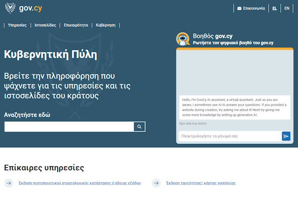
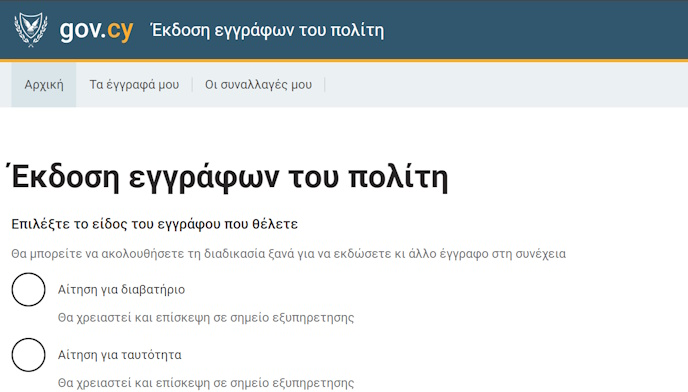

## What's new

**01 July 2024**
Version 3.0.0 of the Design system has been released.

[Read the full change log](https://github.com/gov-cy/govcy-design-system/blob/main/CHANGELOG.md){rel="noreferrer noopener" target="_blank"}.

## Overview
At its core, the gov.cy Unified Design System (UDS) consists of universal assets, elements, components, patterns and code guidance on how to design, build and develop websites and services that make use of the Cyprus government branding and image. This allows its users and teams to build a citizen centric, consistent, clean and intuitive user experience throughout gov.cy, that is accessible to everyone.

    

        

            

                <h2 class="govcy-pt-0">Styles</h2>
                
Make your service and website look like gov.cy with guides for applying layout &amp; grids, spacing, typography, colours and images.

                
<a href="./styles/index.html">Browse styles</a>

            

        

        

            

                <h2 class="govcy-pt-0">Components</h2>
                
Save time and keep the pages consistent with reusable, accesible components for forms, inputs, selections, panels, tables, navigations and more.

                
<a href="./components/index.html">Browse components</a>

            

        

        

            

                <h2 class="govcy-pt-0">Patterns</h2>
                
Help users with completing common tasks such as entering names and addresses, filling and applying for forms and account creation.

                
<a href="./patterns/index.html">Browse patterns</a>

            

        

    

<section class="govcy-my-5">
    

        <h2>In use</h2>
        

            

                

                    

                        
                    

                    
<a href="https://www.gov.cy" target="_blank">gov.cy</a>

                

            

            

                

                    

                        
                    

                    
<a href="https://citizen-documents.staging.gov.cy/" target="_blank">Citizens documents service</a>

                

            

        

    

</section>